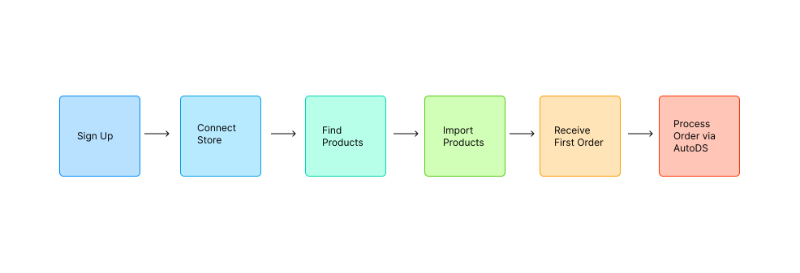

# AutoDS Product Management Case Study

## Overview

The objective was to analyze the current product experience and propose product and UX improvements based on the company’s business goals (OKRs).

The analysis is based on:

* Publicly available information about AutoDS
* UX audit of the onboarding flow
* Product walkthrough

Disclaimer: Since this case study is based on publicly available information, some assumptions were made regarding user behavior and internal product metrics. Where appropriate, I explicitly indicate which hypotheses require validation through analytics or user research.

## Company & Product Context

AutoDS is an all-in-one dropshipping automation platform that helps merchants manage the entire dropshipping workflow, including:

* Product research
* Product importing
* Inventory and price monitoring
* Order fulfillment
* Customer support automation
* Pricing optimization

The assignment states that most AutoDS customers are beginners who are just starting their dropshipping journey.

However, after exploring the onboarding flow, I observed that users are immediately asked to connect an existing selling channel (Shopify, WooCommerce, eBay, Amazon, Wix, etc.). This suggests that many users are already at least partially engaged in e-commerce and are looking for automation rather than education.

This discrepancy is important because it affects onboarding expectations and the amount of guidance users need before experiencing product value.

## Understanding the Business Goals

The assignment defines the following OKRs:

Supporting KPIs:

* Increase AutoDS Paid Orders from 9,000 --> 12,000
* Reduce Day-0 Churn from 13.3% --> 9%
* Expand the Product Finding offering

These KPIs are closely connected. Increasing paid orders requires more users to successfully activate and generate their first sales. Reducing Day-0 churn requires users to experience value earlier.
Expanding Product Finding should improve merchants’ ability to discover products that actually generate sales—not simply increase the number of available products.

## Product Analysis

### KPI A: Increase Paid Orders

Current User Journey
Based on the product walkthrough, the expected user flow appears to be:

To increase paid orders by 33%, there are two possible growth levers:

1. Increase the number of stores that reach their first sale.
2. Increase the number of orders generated by already active stores.

The first lever is likely to have the greatest impact because users cannot generate recurring orders before successfully reaching their first sale.

### Problem 1

Users do not know which products are most likely to generate their first successful sale.

Although AutoDS already provides a Product Finding marketplace with filters, trends and profitability metrics, the experience behaves primarily as a product catalog rather than a decision-support system.

Current experience answers: “What products can I find?”

Instead of: “Which product should I sell first to maximize my chance of success?”

### Proposed Solution

First Sale Probability Engine
Transform Product Finding into an outcome-driven recommendation system.

For each product display:

* First Sale Score
* Demand Trend
* Competition Score
* Expected Profitability
* Recommended for Your Store

Expected impact:

* Better product decisions
* More first sales
* More paid orders

### Problem 2

After importing products, users receive little guidance on how to reach their first sale.

### Proposed Solution

First Sale Accelerator
Create an activation flow focused on a single outcome: "Get Your First Sale"

Example checklist:

* Connect Store
* Import Product
* Configure Pricing
* Publish Product
* Launch Marketing
* Receive First Order

Expected impact:

* Faster Time-to-Value
* Increased activation
* Higher number of processed orders

### Problem 3

Users do not understand why products fail to sell.

### Proposed Solution

Store Performance Insights

Provide contextual recommendations for underperforming products.

Example:

Product has low sales probability because:

* Delivery time is above market average
* Price is higher than competitors
* Product title quality is poor

Expected impact:

* Better optimization decisions
* Higher probability of first sale

To validate these assumptions I would analyze:

* Sign Up --> First Product Import conversion
* Product Import -->  First Order conversion
* Percentage of stores with at least one paid order
* Paid Orders per Active Store

### KPI B: Reduce Day-0 Churn
### KPI C: Expand Product Finding Offering

## Key Product Insights

## UX Improvement Opportunities

### 1. Product Preview & Delayed Paywall
### 2. First Sale Accelerator
### 3. First Sale Probability Engine

## Prioritization (ICE framework)

## Quarterly Roadmap

## Risks & Assumptions

## Success Metrics

## Conclusion